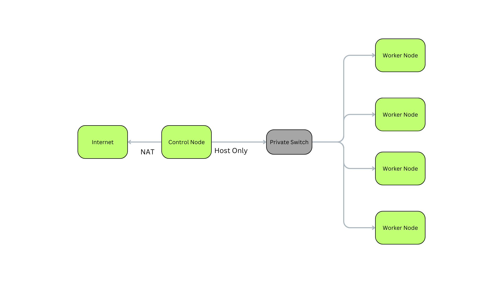

## Perform installation of Warewulf,pbs,ganglia,ldap on single machine

# warewulf:
* Warewulf is an operating system provisioning platform for Linux
* initial release in 2001





### Step 1 : Installation of the warewulf
`GitHub: `
```bash
mkdir ~/git
cd ~/git
git clone https://github.com/hpcng/warewulf.git
cd warewulf
git checkout main # or switch to a tag like '4.2.0'
make all && sudo make install
```

### Step 2 : installing the required services
```bash
yum install dhcp-server tftp-server nfs-utils -y;


``` 

### Step 3 : editing the configuration
[References](https://warewulf.org/docs/development/contents/configuration.html)  
`Location: /etc/warewulf`
```bash
WW_INTERNAL: 43
ipaddr: 192.168.200.1
netmask: 255.255.255.0
network: 192.168.200.0
warewulf:
  port: 9873
  secure: false
  update interval: 60
  autobuild overlays: true
  host overlay: true
  syslog: false
dhcp:
  enabled: true
  range start: 192.168.200.50
  range end: 192.168.200.99
  systemd name: dhcpd
tftp:
  enabled: true
  systemd name: tftp
nfs:
  enabled: true
  export paths:
  - path: /home
    export options: rw,sync
    mount options: defaults
    mount: true
  - path: /opt
    export options: ro,sync,no_root_squash
    mount options: defaults
    mount: false
  systemd name: nfs-server

``` 

