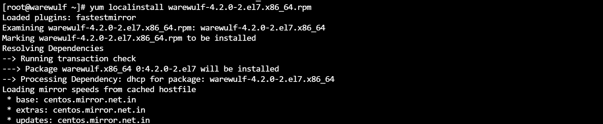
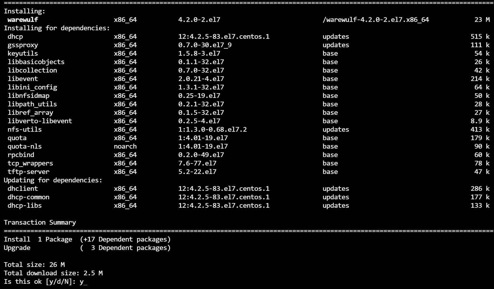

## Perform installation of Warewulf,pbs,ganglia,ldap on single machine

# warewulf:
* Warewulf is an operating system provisioning platform for Linux
* initial release in 2001


### Step 1 : Installation of the warewulf

[Github](https://github.com/hpcng/warewulf/releases/tag/v4.2.0)
```bash
# change the hostname

# disable the selinux

# add services to 
sudo systemctl restart firewalld
sudo firewall-cmd --permanent --add-service warewulf
sudo firewall-cmd --permanent --add-service nfs
sudo firewall-cmd --permanent --add-service tftp
sudo firewall-cmd --reload

# download the repository
wget https://github.com/hpcng/warewulf/releases/tag/v4.2.0;
# install the local 
yum localinstall warewulf-4.2.0-2.el7.x86_64.rpm;

```




### Step 2 : editing the configuration
[References](https://warewulf.org/docs/development/contents/configuration.html)  
`Location: /etc/warewulf`
```bash
WW_INTERNAL: 43
ipaddr: 192.168.200.1
netmask: 255.255.255.0
network: 192.168.200.0
warewulf:
  port: 9873
  secure: false
  update interval: 60
  autobuild overlays: true
  host overlay: true
  syslog: false
dhcp:
  enabled: true
  range start: 192.168.200.50
  range end: 192.168.200.99
  systemd name: dhcpd
tftp:
  enabled: true
  systemd name: tftp
nfs:
  enabled: true
  export paths:
  - path: /home
    export options: rw,sync
    mount options: defaults
    mount: true
  - path: /opt
    export options: ro,sync,no_root_squash
    mount options: defaults
    mount: false
  systemd name: nfs-server

``` 

